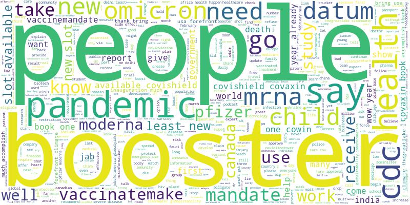

# COVID Tweet Analysis

  

## Abstract: 

This project applies the most important and must-know NLP techniques that every data scientist should be familiar with when building their NLP resume. The text data we'll be working with are scraped tweets from Tweepy, a Twitter API. The project has the following stucture (Jupyter Notebooks):

- Data scraping with custum made wrapper (tool) that uses tweepy ander the hood
- NLP analysis, pretrained sentiment analysis models (label creation)
- Topic modeling - LDA (Latent Dirichlet Allocation) Analysis
- Sentiment analysis

 

### Notebook 1: Scrape Tweets
This notebook will allow you to use the Scraper tool that, given a #hashtag or a serach word and a number of tweets to scrape, it will connect to Tweepy and get non duplicated tweets from the popular social media.

 

### Notebook 2: NLP Essentials
In this notebook we'll see how to process and work with text data and strings. We will look at essential components of a NLP pipeline: text cleaning and lemmatization. We'll then create sentiment labels associated to the tweets using two of the most popular pre-trained models: VADER and TextBlob.

 

### Notebook 3: Topic modeling - LDA
This notebook is around topic model, a type of statistical language models used for uncovering hidden structure in a collection of texts. It is particular type of unsupervised learning, where, like in clustering, the number of topics (clusters) is an input parameter. We will try to see whether we are able to recognize various topics people are talking about on Twitter.

 

### Notebook 4: Sentiment Analysis
We will use tweets and the sentiment labels created in Notebook 2 to train a couple of ML models (Logistic Regression and Ranodm Forest) and check their performance. We will apply text vectorization using TF-IDF

 

## Conclusions
